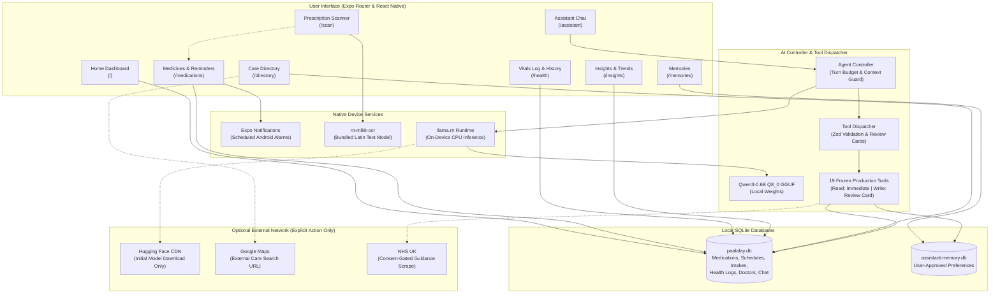

# PAALALAY

**Private AI assistance for everyday health, running on your phone.**

PAALALAY is an Android, offline-first, privacy-focused personal health companion designed to help Filipino patients manage prescribed medications, daily intake schedules, vital health readings, and care facility searches. The application unites local relational database storage, scheduled Android notifications, on-device optical character recognition (OCR), and an on-device compact language model that executes directly on the smartphone without uploading sensitive patient data to cloud servers. The name is derived from the Filipino words *Paalala* (reminder) and *Alalay* (assistance or a steadying hand), joined across their shared letters *ALALA*.

---

## 1. Project Overview

### 1.1 Project Name and Description

PAALALAY is an open-source mobile application for daily personal health management. It addresses the common difficulties patients face when managing multiple medications, fragmented vitals records, and handwritten or printed prescriptions. Operating completely on-device after initial setup, PAALALAY ensures personal health records remain private, accessible during internet outages, and protected against unauthorized cloud telemetry.

### 1.2 The Problem and the Solution

#### The Problem
Managing daily health and chronic conditions presents multiple practical barriers for Filipino patients and families:
- **Medication Complexity and Forgetting:** Managing multi-drug regimens with different dosing times, meal requirements, and instructions frequently leads to missed or mistimed doses.
- **Fragmented and Lost Health Records:** Vitals such as blood pressure and blood glucose are often recorded on paper scraps or forgotten, leaving healthcare providers with incomplete histories during consultations.
- **Privacy and Data Security Concerns:** Patients are hesitant to use cloud-based health tracking applications that transmit sensitive medical histories, chat conversations, and prescription images to external corporate servers.
- **Intermittent Internet Connectivity:** Unreliable mobile data in transit, provincial regions, or indoor clinics frequently leaves cloud-reliant applications inaccessible when patients need their records most.

#### The Solution
PAALALAY addresses these challenges through a self-contained, on-device architecture:
- **Local Relational Database:** All medication schedules, intake history, vital measurements, and user preferences are stored in an app-private SQLite database (`paalalay.db`) residing exclusively on the physical device.
- **On-Device Artificial Intelligence:** A compact language model (Qwen3-0.6B Q8_0) running on-device via `llama.rn` interprets natural conversational requests and queries records locally without cloud inference.
- **Mandatory Confirmation Before Writes:** To prevent unintended modifications or AI hallucination errors, every database write proposed by the conversational assistant requires explicit human confirmation via an interactive review card before execution.
- **Local Prescription Label OCR:** Bundled on-device optical character recognition powered by Google ML Kit extracts text from photos of prescription labels, allowing users to review and copy dosage instructions directly into their schedule.
- **Strict Offline Operation:** Core features—including medication schedules, vitals logs, historical trend charts, and conversational record retrieval—operate seamlessly in airplane mode without internet access.

### 1.3 Key Features

| Feature | Description | Status | Location in Codebase |
| --- | --- | --- | --- |
| **Home Dashboard** | Overview displaying today's scheduled doses, recent vital readings, quick logging actions, and links to assistant and insights modules. | Implemented | `src/features/home/HomeScreen.tsx`, `src/app/index.tsx` |
| **Medication Management** | Add, edit, pause, and inspect medicines with custom dosage forms, strength, and meal instructions copied from prescription leaflets. | Implemented | `src/features/medications/MedicineManagement.tsx`, `src/app/medications.tsx` |
| **Intake History & Logging** | Mark doses as taken or skipped; record adherence events without shifting subsequent scheduled reminder times. | Implemented | `src/features/medications/occurrences.ts`, `src/features/medications/management-service.ts` |
| **Scheduled Device Alarms** | Daily and weekly recurring local notifications; lock-screen alerts display generic reminder notices without disclosing medication names or doses. | Implemented | `src/features/medications/native-reminders.ts` |
| **Vital Measurements Log** | Track 5 distinct measurement types: blood pressure (systolic/diastolic/pulse), blood sugar (fasting/meal contexts), temperature, weight, and symptoms. | Implemented | `src/features/health/HealthHistory.tsx`, `src/app/health.tsx` |
| **Health Insights & Visual Trends** | 7-day adherence statistics and visual trend charts for blood pressure and glucose using native coordinate scaling without external SVG chart services. | Implemented | `src/features/insights/screens/HealthDashboardScreen.tsx`, `src/app/insights.tsx` |
| **On-Device Assistant** | Natural-language chat interface powered by local Qwen3-0.6B inference; executes validated local tools and renders review cards. | Implemented | `src/ai/agent-controller.ts`, `src/features/chat/chat-screen.tsx`, `src/app/assistant.tsx` |
| **Assistant Memory System** | Stores user-confirmed preferences in a dedicated local database (`assistant-memory.db`); memory creation and deletion require confirmation. | Implemented | `src/features/memories/MemoriesScreen.tsx`, `src/features/memories/memories-storage.ts`, `src/app/memories.tsx` |
| **Prescription OCR Scanner** | Bundled native ML Kit Latin model extracts text from prescription images on-device for manual review before saving. | Implemented | `src/features/ocr/screens/ScanPrescriptionScreen.tsx`, `src/features/ocr/services/ocrService.ts`, `src/app/scan.tsx` |
| **Medicine Reference Catalog** | 659 generic medicine names compiled from the Philippine National Formulary (PNF) 2022 with typo-tolerant suggestions. | Implemented | `src/features/medicines/reference/catalog.ts`, `src/features/medicines/reference/medicine-names.json` |
| **Curated Specialist Directory** | Offline directory of verified medical facilities and specialist listings filterable by medical specialty and city. | Implemented | `src/features/doctors/screens/DoctorSearchScreen.tsx`, `src/app/directory.tsx` |
| **Nearby Care Navigation** | Integrates external Google Maps search with rounded coordinates or user-entered city to locate hospitals and clinics; requires internet. | Implemented | `src/features/care/NearbyCareScreen.tsx`, `src/features/care/maps-search.ts` |
| **Permission-Gated NHS Guidance** | Consent-gated web scraper retrieving factual NHS UK guidance excerpts on food interactions and missed doses; requires explicit approval. | Implemented | `src/ai/medicine-guidance.ts` |

### 1.4 System Architecture



### 1.5 Repository Folder Structure

```
paalalay/
├── assets/
│   ├── brand/               # Official icons, splash screen, notification badge, mark
│   └── models/              # Host development directory for local GGUF models
├── docs/                    # Technical architecture, integration, and setup documentation
├── scripts/                 # Server and reset utility scripts
├── src/
│   ├── ai/                  # Local LLM runner, agent loop, tool dispatcher, system prompt
│   ├── app/                 # Expo Router file-based screens and server API endpoints
│   │   ├── api/             # HTTP endpoints for desktop testing environments
│   │   ├── _layout.tsx      # Root navigator with Manrope font loading and theme provider
│   │   ├── assistant.tsx    # AI Assistant route
│   │   ├── directory.tsx    # Specialist directory and nearby care navigation route
│   │   ├── health.tsx       # Health measurement logging route
│   │   ├── index.tsx        # Home dashboard route
│   │   ├── insights.tsx     # Health insights and visual trend charts route
│   │   ├── medications.tsx  # Medication management and reminders route
│   │   ├── memories.tsx     # Assistant saved memories route
│   │   └── scan.tsx         # Prescription OCR scanner route
│   ├── components/          # Shared navigation and UI components
│   ├── constants/           # Linaw design tokens (colors, typography, spacing)
│   ├── contracts/           # Frozen tool definitions, Zod input/output schemas, error types
│   ├── db/                  # SQLite connection manager and database migrations
│   ├── features/            # Feature modules (care, chat, doctors, health, home, insights, medications, medicines, memories, ocr)
│   ├── services/            # Client abstraction layer bridging native SQLite and web API
│   └── types/               # Global TypeScript declarations
├── tests/                   # Automated agent, integration, and database test suites
├── app.json                 # Expo configuration, permissions, and native plugins
├── design.md                # Linaw design system specifications
├── eas.json                 # Expo Application Services build profiles
├── package.json             # Direct dependencies and build scripts
└── tsconfig.json            # TypeScript configuration
```

---

## 2. Team ASCII

PAALALAY was developed by **Team ASCII** for the APPH Hackathon.

| Team Member | Role & Key Contributions |
| --- | --- |
| **Mark Joshua Bueta** | Insights & Directory: Health dashboard, adherence calculations, trend charts, curated specialist repository, search services. |
| **Jestaly Joseph Castillo** | Medications & Health Records: Medication management, schedule replacement, intake logs, 5 vital measurement repositories. |
| **Karl John Crespo** | Agent Architecture & Core Tools: Agent controller loop, tool dispatcher, local model integration, system prompts, memory handlers. |
| **Francis Adrian Gapol** | Application Shell, Database & Native Modules: SQLite database foundation, migration runner, native OCR adapter, navigation routing, EAS config. |

*Note: All four team members contributed code to the repository. The GitHub account `ashooo` served as repository administrator and integration coordinator.*

---

## 3. The Proof: Verification and Replication Guide

### 3.1 What Runs Locally On-Device

| Capability | How It Operates On-Device | Key Library / File |
| --- | --- | --- |
| **Database Storage** | SQLite relational database stored in sandboxed storage; foreign keys enforced; transactional migrations. | `expo-sqlite`, `src/db/index.ts` |
| **Scheduled Reminders** | Native Android alarms scheduled via notification manager; recurring daily/weekly triggers; generic lock-screen alerts. | `expo-notifications`, `src/features/medications/native-reminders.ts` |
| **Health Measurements** | Validated measurements stored across 5 dedicated log types with UTC timestamps and user-entered notes. | `src/features/health/HealthHistory.tsx`, `src/db/migrations/001_initial_baseline.ts` |
| **Local Language Model** | GGUF quantized model running on device CPU using llama.cpp bindings; zero server roundtrips. | `llama.rn`, `src/ai/local-model.ts` |
| **Assistant Memory** | Dedicated SQLite database (`assistant-memory.db`) retaining confirmed user preferences across sessions. | `src/features/memories/memories-storage.ts` |
| **Prescription OCR** | Bundled Google ML Kit Latin model running locally; extracts text without network connectivity. | `rn-mlkit-ocr`, `src/features/ocr/services/ocrService.ts` |
| **Medicine Catalog** | In-memory lookup of 659 Philippine National Formulary generic names with typo-tolerant matching. | `src/features/medicines/reference/catalog.ts` |
| **Doctor Directory** | Searchable local database table indexed on specialty and city with verifiable provenance records. | `src/features/doctors/repository/doctor.repository.ts` |
| **Vitals & Adherence Trends** | Pure React Native charts rendered with mathematical scaling without external web views or SVG chart services. | `src/features/insights/components/TrendChart.tsx` |

### 3.2 What Requires Internet

| Category | Network Destination / Purpose | Telemetry & Privacy Notice |
| --- | --- | --- |
| **Runtime: Initial Model Setup** | `https://huggingface.co/Qwen/Qwen3-0.6B-GGUF/...` (one-time download of pinned 639 MB GGUF weights on first Assistant open). | Downloads model weights once. SHA-256 verified. No user credentials or device identifiers transmitted. |
| **Runtime: Nearby Care (Optional)** | `https://www.google.com/maps/search/...` (external Google Maps search for clinics and hospitals). | Opens external Google Maps app or browser. Coordinates are rounded to 3 decimal places; never stored in SQLite. |
| **Runtime: Medicine Guidance (Optional)** | `https://www.nhs.uk/medicines/...` (retrieval of factual food/missed-dose guidance). | Gated by explicit confirmation. Sends only generic medicine name. Omits cookies, credentials, and user history. |
| **Build & Dev Time Only** | npm registry (`registry.npmjs.org`), Android Maven repositories, EAS cloud build services, Metro bundler. | Required only during application compilation and packaging. Not called by the running production APK. |

*Telemetric Transparency:* PAALALAY contains **zero** analytics, tracking, or crash-reporting SDKs (no Sentry, Firebase, Segment, or Amplitude). Outside the explicit user actions listed above, the application generates **no** background network traffic.

### 3.3 Replicating and Running the Project

> **IMPORTANT BRANCH SELECTION FOR JUDGES:**
> The team's active development branch is **`development`**. It contains 40 integrated commits ahead of `main`, including the complete local AI model provisioning, memory storage, prescription OCR, medication management, and insights dashboards. Judges should clone and evaluate the **`development`** branch.

#### Step 1: System Prerequisites
- **Node.js:** Node.js LTS version 22.13.0 or newer (tested with v24.21.0).
- **Package Manager:** npm (installed with Node.js). On Windows PowerShell, use `npm.cmd` and `npx.cmd`.
- **Java Development Kit (JDK):** JDK 17 (recommended for Expo SDK 57 Android builds).
- **Android Studio & SDK:** Android SDK Platform 35, Build-Tools 35.0.0, Android NDK/CMake if building native modules locally, and `adb` available on PATH.
- **Hardware/Emulator:** Android device or emulator running Android 10 (API level 29) or newer with at least 1 GB of free storage.

#### Step 2: Clone the Repository and Check Out Development
```bash
git clone https://github.com/ashooo/paalalay.git
cd paalalay
git switch development
```

#### Step 3: Install Dependencies
```bash
npm ci
```

#### Step 4: Validate Codebase and Run Automated Test Suite
Before running the native application, execute the automated verification suite:
```bash
npm run lint
npm run typecheck
npm run test:agent
```
*Expected Result:* All 64 test cases pass, covering the tool dispatcher, agent controller, database persistence, memory management, and production handlers.

#### Step 5: Obtaining and Placing the Local Model File
The embedded Qwen3-0.6B language model is loaded locally. You have two options:

- **Automatic Download (Recommended):** Simply launch the app on an Android device or emulator with internet connectivity and open the **Assistant** tab. The app will automatically download the pinned model from Hugging Face, verify its SHA-256 hash (`9465e63a...`), and place it into app-private storage.
- **Manual Host Pre-loading (Optional for Host Development):**
  - Download the official model file from Hugging Face:
    `https://huggingface.co/Qwen/Qwen3-0.6B-GGUF/resolve/23749fefcc72300e3a2ad315e1317431b06b590a/Qwen3-0.6B-Q8_0.gguf`
  - File Name: `Qwen3-0.6B-Q8_0.gguf`
  - Expected Size: `639,446,688 bytes` (~639 MB)
  - Destination for host-side tooling: `assets/models/Qwen3-0.6B-Q8_0.gguf` (Note: Files placed here are git-ignored and not bundled into the APK).

#### Step 6: Building and Installing the Development Client
Because PAALALAY integrates custom native C++ libraries (`llama.rn` and native ML Kit), **Expo Go is not supported**. A native development build must be compiled:

*Option A: Cloud Build via EAS (Recommended)*
```bash
npx eas-cli@latest login
npx eas-cli@latest build --platform android --profile development
```
Download and install the generated APK on your device or emulator.

*Option B: Local Android Build (Requires Android SDK & NDK on PATH)*
```bash
npx expo run:android
```

#### Step 7: Starting Metro Bundler
Start the development server and connect your development build:
```bash
npx expo start --dev-client --port 8087
```

#### Step 8: Quick Demo Path for Judges (5-Minute Tour)
1. **Home Screen (`/`):** View the greeting, database readiness indicator, today's medication summary, and recent vitals readings.
2. **Medicines Tab (`/medications`):**
   - Tap **Add medicine**. Enter "Amlodipine", select "5 mg", and input prescription instructions (e.g., "Take 1 tablet every morning with water").
   - Set reminder time to `08:00`. Tap **Save schedule and enable reminders**.
   - Notice the generic notification preview card.
3. **Log Tab (`/health`):**
   - Select **Blood Pressure**. Enter `120` systolic and `80` diastolic. Tap **Save reading**.
   - Select **Blood Sugar**. Enter `95`, choose unit `mg/dL`, and select `Fasting`. Tap **Save reading**.
   - Observe the saved readings appearing instantly in the history list.
4. **Insights Screen (`/insights`):**
   - Tap **Health Insights** from the Home dashboard.
   - Observe the 7-day adherence card and the interactive Linaw vitals trend charts showing the recorded blood pressure and blood sugar.
5. **Assistant Tab (`/assistant`):**
   - Open **Assistant**. If opening for the first time, allow model download and verification to complete.
   - In chat, type: `"What medicines should I take today?"`
   - Observe the local model invoking `get_today_medications` and displaying the scheduled dose.
   - Type: `"Please log my blood pressure as 125 over 82."`
   - Observe the model proposing `log_blood_pressure`. **A confirmation review card appears.** Tap **Confirm** to commit the record to SQLite.
6. **Care Tab (`/directory`):**
   - Search for "Cardiology" in the offline specialist directory to view curated facilities with source provenance.
   - Toggle to "Nearby Facilities (Maps)" to test Google Maps location search.

#### Step 9: Verifying Strict Offline Operation
1. Place the test device or emulator in **Airplane Mode** (disable Wi-Fi and Cellular Data).
2. Force-close and reopen PAALALAY.
3. Navigate to **Medicines**, **Log**, **Insights**, and **Directory**: all saved records, history entries, and trend graphs load immediately from local SQLite.
4. Open **Assistant**: submit a query such as `"Summarize my health readings"`. The local Qwen3 model executes on device CPU and returns results without network access.

#### Step 10: Windows Troubleshooting Guide

| Issue | Cause | Resolution |
| --- | --- | --- |
| `npm.ps1 cannot be loaded because running scripts is disabled` | Windows PowerShell execution policy restriction. | Use `npm.cmd` and `npx.cmd`, or execute `Set-ExecutionPolicy -Scope Process -ExecutionPolicy Bypass` in the current terminal. |
| `PluginError: Failed to resolve plugin for module "expo-location"` | Fresh clone missing node_modules installation. | Run `npm ci` before launching Expo CLI. |
| `Port 8081 is already in use` | Another process (e.g. earlier Metro or dev server) occupies the default port. | Specify a dedicated port: `npx expo start --dev-client --port 8087`. |
| `adb: command not found` | Android SDK platform-tools missing from PATH environment variable. | Add `%LOCALAPPDATA%\Android\Sdk\platform-tools` to your Windows user `PATH`. |
| `Filename too long (Git error)` | Windows default MAX_PATH 260-character limit exceeded. | Run `git config --system core.longpaths true` as Administrator. |

---

## 4. Disclosures

### 4.1 AI Models Used
- **AI Models Used in Development:**
  - **Google Antigravity:** Gemini Flash 3.8
  - **Devin AI:** Devin SWE-1.6 Slow
  - **Codex:** GPT-6.1 Sol 
  - **Claude:** Claude 3.7 Sonnet and Claude 3 Opus
  *Assistance Scope:* Utilized for scaffolding TypeScript contracts, validating Zod schemas, generating unit test fixtures, and implementing responsive UI components. All generated code was reviewed, adapted, and tested by Team ASCII.
- **Embedded On-Device AI Model:**
  - **Model:** [Qwen3-0.6B-GGUF](https://huggingface.co/Qwen/Qwen3-0.6B-GGUF) (Alibaba Cloud)
  - **Quantization:** `Q8_0` (8-bit quantization for mobile CPU efficiency)
  - **Binary File Name:** `Qwen3-0.6B-Q8_0.gguf` (`639,446,688 bytes`, SHA-256: `9465e63a22add5354d9bb4b99e90117043c7124007664907259bd16d043bb031`)
  - **Inference Engine:** `llama.rn` (`^0.13.0-rc.7`)
  - **Execution:** Runs 100% locally on device CPU/NPU with an 8,192-token context window and 512-token output limit. Zero prompt or response data is sent to external servers.

### 4.2 Technologies and Framework Used
| Technology / Framework | Version | Purpose | License |
| --- | --- | --- | --- |
| **Expo & Expo Router** | `~57.0.27` / `~57.0.25` | Cross-platform application framework and file-based routing | MIT |
| **React Native & React** | `0.86.3` / `19.2.3` | Native mobile rendering engine (Hermes enabled) and UI library | MIT |
| **TypeScript** | `~6.0.3` | Static typing, interface definitions, and contract enforcement | Apache-2.0 |
| **Expo SQLite** | `~57.0.4` | Local relational database storage with foreign keys and migrations | MIT |
| **llama.rn** | `^0.13.0-rc.7` | Native React Native bindings for llama.cpp on-device GGUF execution | MIT |
| **rn-mlkit-ocr** | `^0.3.1` | Bundled on-device Google ML Kit Latin text recognition | MIT |
| **Expo Notifications** | `~57.0.22` | Scheduled local Android alarms and reminder manager | MIT |
| **Expo Image Picker** | `~57.0.20` | Camera and photo gallery access for prescription scanning | MIT |
| **Zod** | `^4.6.5` | Runtime schema validation for tool parameters and review envelopes | MIT |
| **@noble/hashes & Expo Crypto** | `^2.4.0` / `~57.0.3` | Cryptographic SHA-256 model verification and UUID generation | MIT |
| **Manrope (@expo-google-fonts)** | `^0.4.2` | Accessible Linaw design typography | MIT & OFL-1.1 |
| **React Native Reanimated** | `4.5.1` | Smooth UI transitions and animated micro-interactions | MIT |

### 4.3 APIs and Cloud Services Used
- **Runtime Cloud Services:** **None.** The application operates without cloud LLM APIs, telemetry platforms, analytics trackers, or remote user authentication.
- **Optional Network Endpoints (Explicit User Action Only):**
  - **Hugging Face (`huggingface.co`):** One-time download of verified Qwen3-0.6B weights during initial Assistant setup.
  - **Google Maps (`google.com/maps`):** External facility search URL opened in browser or Maps app for nearby hospital navigation.
  - **NHS UK (`nhs.uk`):** Consent-gated web scraper for factual missed-dose and food guidance.
- **Build & Development Services:** EAS Build (cloud compilation), GitHub (version control), npm Registry (package hosting).

### 4.4 Existing Code and Assets
- **Framework Template:** Scaffolding derived from the official Expo TypeScript starter template.
- **Open-Source Libraries:** Direct dependencies listed under MIT License (with Manrope under OFL-1.1 and TypeScript under Apache-2.0).
- **Brand Assets:** Custom mark, adaptive icon, notification badge, and favicon designed under the Linaw design system (`assets/brand/`).
- **Medicine Reference Data:** 659 generic medicine names extracted from the official Philippine National Formulary (PNF) Essential Medicines List (EML) 2022 (`src/features/medicines/reference/PNF_EML_2022_medicine_names.csv`).
- **Specialist Directory Data:** Curated dataset of facilities across Metro Manila (`src/features/doctors/data/placeholder-doctors.ts`). *Synthetic records are disclosed as placeholders pending independent medical verification.*
- **AI-Assisted Code:** All AI-scaffolded contracts, schemas, and components were reviewed, adapted, and tested by Team ASCII.

### 4.5 AI Development Tools Used
- **Expo:** Framework CLI, local bundler, and development build tooling.
- **React Native API:** Native component interfaces and platform abstractions.
- **Postman:** Exploratory API endpoint modeling (all production mobile tests run through native test runners).
- **Ollama:** Local model experimentation during exploration.
- **Qwen3 model:** Local model evaluation and prompt testing.

---

## 5. Privacy, Safety & Limitations

### 5.1 Not Medical Advice
PAALALAY is an informational self-management tool. It is **not** a certified medical device and does not provide clinical diagnoses, medical advice, prescription generation, or automated dosage recalculation. Users must consult licensed medical practitioners and pharmacists regarding their treatment plans.

### 5.2 Safe Prescribing & Extraction Guardrails
- **No Automatic Schedule Generation:** OCR prescription scanning extracts raw text for human review only. It does not automatically schedule reminders or save medicines to the database without explicit user inspection and save actions.
- **No Inferred Dosages:** The conversational AI model is strictly prohibited from inventing dosages, catch-up plans, or food guidance. Missing details require user clarification.
- **Mandatory Write Confirmation:** All database insertions or deletions initiated through chat require human confirmation via interactive review cards before execution.

### 5.3 Local Storage Encryption Notice
In this demonstration build, local SQLite databases (`paalalay.db` and `assistant-memory.db`) reside in the Android app's sandboxed data directory without application-level database encryption (SQLCipher). Device-level encryption (Android Keystore / device PIN / biometrics) protects the device. Production clinical deployments would require SQLCipher database encryption.

### 5.4 Known Limitations
- Initial model download requires approximately 639 MB of network transfer and free disk space.
- Local CPU inference speeds vary depending on device chipset RAM and thermal throttling.
- Background alarm delivery relies on device-specific battery optimization settings and notification permissions.

---

## 6. Project Structure, Contributing & License

### 6.1 Branch Workflow
- **`main`:** Stable release branch.
- **`development`:** Primary active integration branch where all feature modules are unified and verified.
- **Feature Branches:** Scoped branches (e.g., `feat/dev3`, `feat/apis`, `feat/dev-4`, `feat/llm`) targeting `development` via pull requests.

### 6.2 License
PAALALAY is distributed under the **MIT License**.

```
Copyright (c) 2015-present 650 Industries, Inc. (aka Expo)
Copyright (c) 2026 Team ASCII

Permission is hereby granted, free of charge, to any person obtaining a copy
of this software and associated documentation files (the "Software"), to deal
in the Software without restriction, including without limitation the rights
to use, copy, modify, merge, publish, distribute, sublicense, and/or sell
copies of the Software, and to permit persons to whom the Software is
furnished to do so, subject to the following conditions:

The above copyright notice and this permission notice shall be included in all
copies or substantial portions of the Software.

THE SOFTWARE IS PROVIDED "AS IS", WITHOUT WARRANTY OF ANY KIND, EXPRESS OR
IMPLIED, INCLUDING BUT NOT LIMITED TO THE WARRANTIES OF MERCHANTABILITY,
FITNESS FOR A PARTICULAR PURPOSE AND NONINFRINGEMENT. IN NO EVENT SHALL THE
AUTHORS OR COPYRIGHT HOLDERS BE LIABLE FOR ANY CLAIM, DAMAGES OR OTHER
LIABILITY, WHETHER IN AN ACTION OF CONTRACT, TORT OR OTHERWISE, ARISING FROM,
OUT OF OR IN CONNECTION WITH THE SOFTWARE OR THE USE OR OTHER DEALINGS IN THE
SOFTWARE.
```
